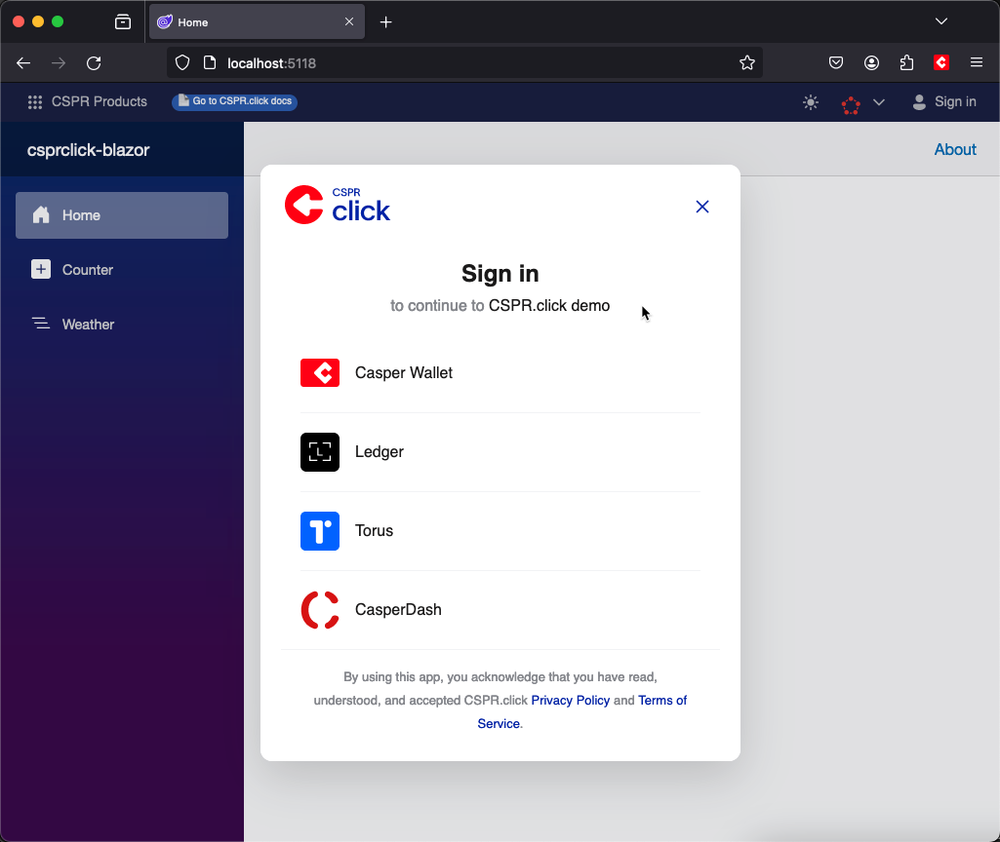

# CSPR.click ASP.NET Core Blazor Example

This directory contains a sample application built from the common Blazor template to which we've integrated the CSPR.click UI SDK.

To test the application, make sure you have .NET 8 SDK installed:

```bash
dotnet --version
```

You should see version `8.0.100` or newer.

Then, run the project and browse to [http://localhost:5118](http://localhost:5118). 

```bash
dotnet run
```

